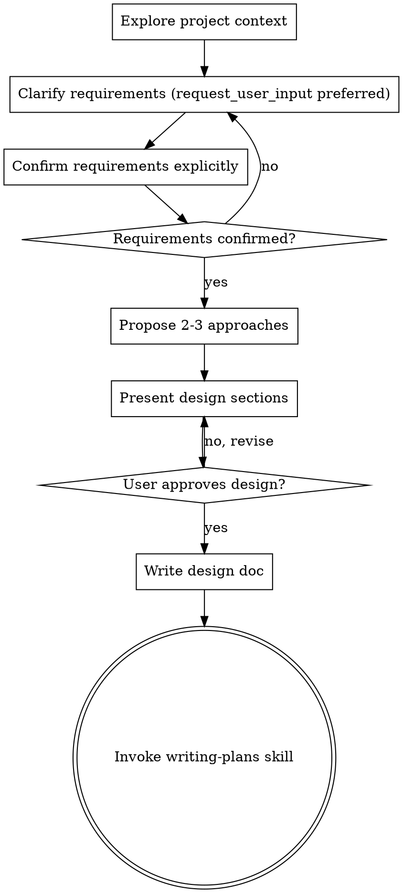

# Brainstorming Ideas Into Designs

## Overview

Help turn ideas into fully formed designs and specs through natural collaborative dialogue.

Start by understanding the current project context, then clarify and confirm requirements before proposing designs. Prefer `request_user_input` for structured interaction when available. Once requirements are confirmed, present the design and get user approval.

<HARD-GATE>
Do NOT invoke any implementation skill, write any code, scaffold any project, or take any implementation action until you have presented a design and the user has approved it. This applies once the task is routed to brainstorming.
</HARD-GATE>

## Interaction Rule: request_user_input Preferred

When requirement clarification or confirmation is needed:
- Prefer `request_user_input` (if available in the current mode)
- Ask 1-3 short, high-leverage questions per call
- Use multiple-choice options with a recommended default when possible
- If `request_user_input` is unavailable, ask the same questions directly in chat

Do not proceed to approaches or design until requirement confirmation is explicit.

## Routing Rule: Complexity Gate

Use brainstorming for medium/high-complexity tasks:
- Multiple files/systems likely to change
- Architectural or product trade-offs are required
- Failure impact is non-trivial (data, security, reliability, large UX change)
- Scope is uncertain enough to require structured option analysis

Do not use brainstorming for simple/low-risk tasks. Route those to ask-questions-if-underspecified first.

## Checklist

You MUST create a task for each of these items and complete them in order:

1. **Explore project context** — check files, docs, recent commits
2. **Clarify requirements** — prefer `request_user_input`; understand purpose/scope/constraints/success criteria
3. **Confirm requirements** — restate objective, in-scope/out-of-scope, constraints, and acceptance criteria; get explicit user confirmation
4. **Propose 2-3 approaches** — with trade-offs and your recommendation
5. **Present design** — in sections scaled to their complexity, get user approval after each section
6. **Write design doc** — save to `docs/plans/YYYY-MM-DD-<topic>-design.md` and commit
7. **Transition to implementation** — invoke writing-plans skill to create implementation plan

## Process Flow

**The terminal state is invoking writing-plans.** Do NOT invoke frontend-design, mcp-builder, or any other implementation skill. The ONLY skill you invoke after brainstorming is writing-plans.

## The Process

**Understanding the idea:**
- Check out the current project state first (files, docs, recent commits)
- Prefer `request_user_input` to ask clarifying questions; if unavailable, ask in chat
- Ask questions one at a time (or 1-3 per `request_user_input` call) to refine the idea
- Prefer multiple choice questions when possible, but open-ended is fine too
- Focus on understanding: objective, in-scope/out-of-scope, constraints, dependencies, success criteria

**Requirement confirmation (mandatory gate):**
- Restate confirmed requirements in concise bullets before proposing approaches
- Include: objective, scope boundaries, constraints, and acceptance criteria
- Ask for explicit confirmation; revise until user confirms
- Do not move to approach/design before confirmation

**Exploring approaches:**
- Propose 2-3 different approaches with trade-offs
- Present options conversationally with your recommendation and reasoning
- Lead with your recommended option and explain why

**Presenting the design:**
- Once you believe you understand what you're building, present the design
- Scale each section to its complexity: a few sentences if straightforward, up to 200-300 words if nuanced
- Ask after each section whether it looks right so far
- Cover: architecture, components, data flow, error handling, testing
- Be ready to go back and clarify if something doesn't make sense

## After the Design

**Documentation:**
- Write the validated design to `docs/plans/YYYY-MM-DD-<topic>-design.md`
- Use elements-of-style:writing-clearly-and-concisely skill if available
- Commit the design document to git

**Implementation:**
- Invoke the writing-plans skill to create a detailed implementation plan
- Do NOT invoke any other skill. writing-plans is the next step.

## Key Principles

- **One question at a time** - Don't overwhelm with multiple questions
- **Multiple choice preferred** - Easier to answer than open-ended when possible
- **YAGNI ruthlessly** - Remove unnecessary features from all designs
- **Explore alternatives** - Always propose 2-3 approaches before settling
- **Incremental validation** - Present design, get approval before moving on
- **Be flexible** - Go back and clarify when something doesn't make sense
