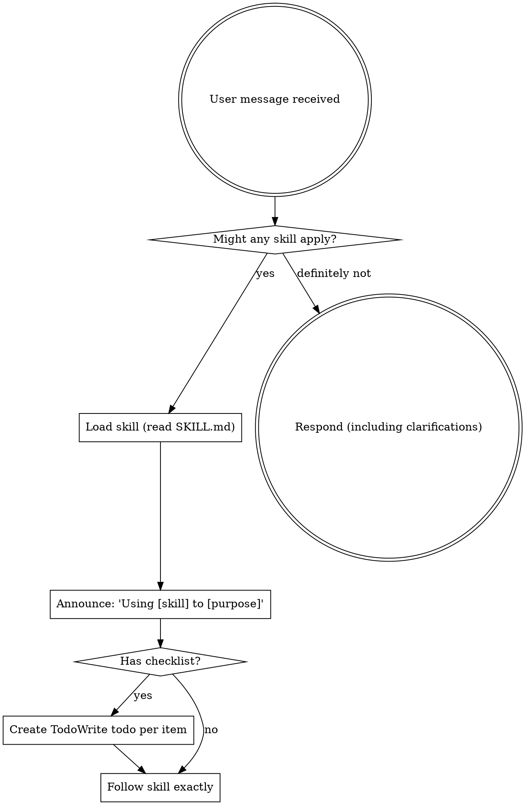

> **Core principle: If any skill might be relevant to the current task, you MUST load and read it before taking action.**
>
> This is non-negotiable. Even a 1% chance means you should check. If a loaded skill turns out to be irrelevant, you can skip it.

**Universal rules:**
- Skills MUST be actually read and followed, never relied on from memory
- Skills evolve over time — always read the current version before use

# Using Skills

## The Rule

**Invoke relevant or requested skills BEFORE any response or action.** Even a 1% chance a skill might apply means that you should invoke the skill to check. If an invoked skill turns out to be wrong for the situation, you don't need to use it.

## Red Flags

These thoughts mean STOP—you're rationalizing:

| Thought | Reality |
|---------|---------|
| "This is just a simple question" | Questions are tasks. Check for skills. |
| "I need more context first" | Skill check comes BEFORE clarifying questions. |
| "Let me explore the codebase first" | Skills tell you HOW to explore. Check first. |
| "I can check git/files quickly" | Files lack conversation context. Check for skills. |
| "Let me gather information first" | Skills tell you HOW to gather information. |
| "This doesn't need a formal skill" | If a skill exists, use it. |
| "I remember this skill" | Skills evolve. Read current version. |
| "This doesn't count as a task" | Action = task. Check for skills. |
| "The skill is overkill" | Simple things become complex. Use it. |
| "I'll just do this one thing first" | Check BEFORE doing anything. |
| "This feels productive" | Undisciplined action wastes time. Skills prevent this. |
| "I know what that means" | Knowing the concept ≠ using the skill. Invoke it. |

## Skill Priority

When multiple skills could apply, use this order:

1. **Process skills first** (ask-questions-if-underspecified, brainstorming, debugging) - these determine HOW to approach the task
2. **Implementation skills second** (frontend-design, mcp-builder) - these guide execution

"Let's build X" → choose process skill by complexity, then implementation skills.
"Fix this bug" → debugging first, then domain-specific skills.

## Interaction Default: request_user_input First

When clarification, confirmation, or decision-making is needed during a workflow:

- Default to `request_user_input` for structured user interaction.
- Keep each call short and high-leverage (1-3 questions, clear options, recommended default).
- Avoid long free-form back-and-forth when structured prompts can reduce interaction turns.
- If `request_user_input` is unavailable in the current mode, fall back to concise numbered text Q&A in chat.

### Complexity Routing (Required)

- **Simple/low-risk tasks**: use ask-questions-if-underspecified first.
- **Medium/high-complexity tasks**: use brainstorming first.

Quick heuristic:
- Use ask-questions-if-underspecified when the likely change is small and uncertainty is mostly missing details.
- Use brainstorming when there are architectural trade-offs, larger blast radius, or significant ambiguity in solution direction.

## Skill Types

**Rigid** (TDD, debugging): Follow exactly. Don't adapt away discipline.

**Flexible** (patterns): Adapt principles to context.

The skill itself tells you which.

## User Instructions

Instructions say WHAT, not HOW. "Add X" or "Fix Y" doesn't mean skip workflows.
